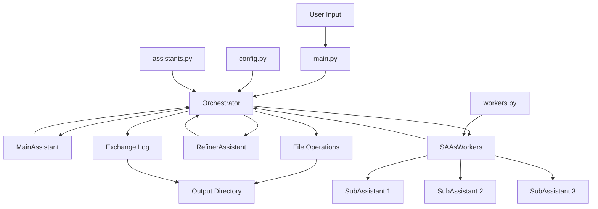

# Smart Autonomous Assistants (SAAs) Project

## Table of Contents

- [Smart Autonomous Assistants (SAAs) Project](#smart-autonomous-assistants-saas-project)
  - [Table of Contents](#table-of-contents)
  - [Introduction](#introduction)
  - [Features](#features)
  - [Project Structure](#project-structure)
  - [Module Descriptions](#module-descriptions)
  - [Dependencies](#dependencies)
  - [Setup and Installation](#setup-and-installation)
  - [Configuration](#configuration)
  - [Usage](#usage)
  - [Development Setup](#development-setup)
  - [Testing](#testing)
  - [Continuous Integration](#continuous-integration)
  - [System Architecture](#system-architecture)
  - [Contributing](#contributing)
  - [License](#license)

## Introduction

The Smart Autonomous Assistants (SAAs) project is a sophisticated AI-driven system designed to orchestrate multiple AI assistants to accomplish complex tasks. By leveraging the power of large language models and a modular architecture, this system can break down objectives, execute sub-tasks in parallel, and refine results to produce coherent outputs.

## Features

- Multi-assistant orchestration for complex task completion
- Support for multiple LLM providers (Claude, GPT, Gemini)
- Parallel processing of subtasks using SAAsWorkers
- Modular architecture for easy extension and customization
- Automated task breakdown and execution
- Integration with external tools (e.g., TavilyTools)
- File operation capabilities for input/output handling
- Detailed logging of workflow execution
- Fallback mechanisms for improved reliability

## Project Structure

```
smart-autonomous-assistants/
├── src/
│   ├── __init__.py
│   ├── assistants.py
│   ├── config.py
│   ├── main.py
│   ├── orchestrator.py
│   ├── workers.py
│   └── utils/
│       ├── exceptions.py
│       └── logging.py
├── tests/
│   ├── __init__.py
│   ├── test_orchestrator.py
│   └── test_workers.py
├── .github/
│   └── workflows/
│       └── ci.yml
├── output/
├── README.md
├── CHANGELOG.md
├── setup.py
├── pyproject.toml
├── requirements.txt
├── requirements-dev.txt
├── .gitignore
└── .env
```

## Module Descriptions

1. **src/assistants.py**: Implements dynamic assistant creation supporting multiple LLM providers and manages file operations and tool integration.
2. **src/config.py**: Handles configuration settings, environment variables, and API key management.
3. **src/main.py**: Provides the command-line interface using Typer for running workflows.
4. **src/orchestrator.py**: Implements the core workflow management logic and coordinates interactions between assistants.
5. **src/workers.py**: Implements the SAAsWorkers class for parallel task processing and planning.

## Dependencies

Main dependencies include:

- phidata==2.4.22
- pydantic==2.7.4
- python-dotenv==1.0.1
- typer==0.12.3
- rich==13.7.1

For a full list of dependencies, see `requirements.txt` and `requirements-dev.txt`.

## Setup and Installation

1. Clone the repository
2. Create and activate a virtual environment
3. Install dependencies: `pip install -r requirements.txt`
4. Create a `.env` file with your API keys and VertexAI settings

## Configuration

Update the `settings` in `src/config.py` to configure LLM models and other parameters.

## Usage

Run a workflow using:

```
python -m src.main run-workflow "Your objective here"
```

## Development Setup

1. Install development dependencies: `pip install -r requirements-dev.txt`
2. Install pre-commit hooks: `pre-commit install`

## Testing

Run tests using pytest:

```
pytest
```

## Continuous Integration

The project uses GitHub Actions for CI/CD, running tests and checks on each push and pull request.

## System Architecture



This architecture allows for a flexible and extensible system that can handle complex, multi-step tasks by leveraging the strengths of multiple AI assistants and parallel processing capabilities.

## Contributing

Contributions are welcome! Please read the CONTRIBUTING.md file for guidelines.

## License

This project is licensed under the MIT License - see the LICENSE file for details.
