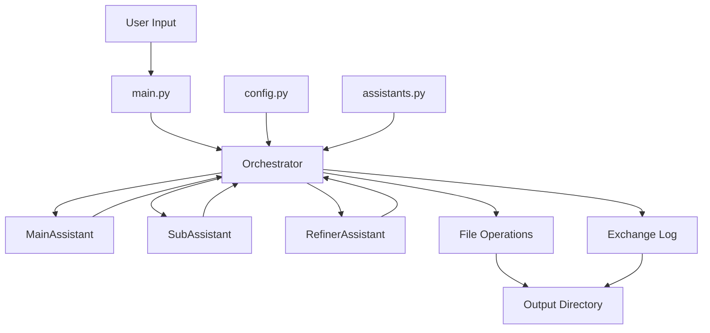

# Smart Autonomous Assistants (SAAs) Project

## Table of Contents

- [Smart Autonomous Assistants (SAAs) Project](#smart-autonomous-assistants-saas-project)
  - [Table of Contents](#table-of-contents)
  - [Introduction](#introduction)
  - [Features](#features)
  - [Project Structure](#project-structure)
  - [Module Descriptions](#module-descriptions)
    - [1. src/assistants.py](#1-srcassistantspy)
    - [2. src/config.py](#2-srcconfigpy)
    - [3. src/main.py](#3-srcmainpy)
    - [4. src/orchestrator.py](#4-srcorchestratorpy)
  - [Dependencies](#dependencies)
  - [Setup and Installation](#setup-and-installation)
  - [Configuration](#configuration)
  - [Usage](#usage)
  - [Development Setup](#development-setup)
  - [Testing](#testing)
  - [Continuous Integration](#continuous-integration)
  - [System Architecture](#system-architecture)
  - [Contributing](#contributing)
  - [License](#license)

## Introduction

The Smart Autonomous Assistants (SAAs) project is a sophisticated AI-driven system designed to orchestrate multiple AI assistants to accomplish complex tasks. By leveraging the power of large language models and a modular architecture, this system can break down objectives, execute sub-tasks, and refine results to produce coherent outputs.

## Features

- Multi-assistant orchestration for complex task completion
- Support for multiple LLM providers (Claude, GPT, Gemini)
- Modular architecture for easy extension and customization
- Automated task breakdown and execution
- Integration with external tools (e.g., TavilyTools)
- File operation capabilities for input/output handling
- Detailed logging of workflow execution
- Fallback mechanisms for improved reliability

## Project Structure

```
smart-autonomous-assistants/
├── src/
│   ├── __init__.py
│   ├── assistants.py
│   ├── config.py
│   ├── main.py
│   └── orchestrator.py
├── tests/
│   ├── __init__.py
│   └── test_orchestrator.py
├── .github/
│   └── workflows/
│       └── ci.yml
├── output/
├── README.md
├── setup.py
├── pyproject.toml
├── requirements.txt
├── .gitignore
└── .env
```

## Module Descriptions

### 1. src/assistants.py

- Implements dynamic assistant creation supporting multiple LLM providers
- Manages file operations and tool integration

### 2. src/config.py

- Handles configuration settings and environment variables
- Implements API key management and validation

### 3. src/main.py

- Provides the command-line interface using Typer
- Handles workflow initialization and error reporting

### 4. src/orchestrator.py

- Implements the core workflow management logic
- Coordinates interactions between assistants and manages the overall process

## Dependencies

| Dependency    | Version | Purpose                                     |
| ------------- | ------- | ------------------------------------------- |
| phidata       | 2.4.22  | Provides the base Assistant class and tools |
| pydantic      | 2.7.4   | Data validation and settings management     |
| python-dotenv | 1.0.1   | Loads environment variables from .env file  |
| typer         | 0.12.3  | Creates CLI interfaces                      |
| rich          | 13.7.1  | Enhanced terminal output                    |

## Setup and Installation

1. Clone the repository:

   ```
   git clone https://github.com/waveuphq/smart-autonomous-assistants.git
   cd smart-autonomous-assistants
   ```

2. Create and activate a virtual environment:

   ```
   python -m venv venv
   source venv/bin/activate  # On Windows, use `venv\Scripts\activate`
   ```

3. Install dependencies:

   ```
   pip install -r requirements.txt
   ```

4. Create a `.env` file in the project root and add your API keys and VertexAI settings:
   ```
   ANTHROPIC_API_KEY=your_anthropic_api_key
   OPENAI_API_KEY=your_openai_api_key
   GOOGLE_API_KEY=your_google_api_key
   TAVILY_API_KEY=your_tavily_api_key
   VertexAI_Project_Name=your_vertexai_project_id
   VertexAI_Location=your_vertexai_location
   ```

## Configuration

The project supports multiple LLM providers. Update the `MAIN_ASSISTANT`, `SUB_ASSISTANT`, and `REFINER_ASSISTANT` settings in `src/config.py` to use the desired models.

## Usage

To run a workflow, use the following command:

```
python -m src.main run-workflow "Your objective here"
```

Example:

```
python -m src.main run-workflow "Create a python script to copy all .py files content and exclude files and folder excluded in the .gitignore uses Typer commands"
```

## Development Setup

To set up the development environment:

1. Clone the repository and navigate to the project directory.
2. Create and activate a virtual environment:
   ```
   python -m venv venv
   source venv/bin/activate  # On Windows, use `venv\Scripts\activate`
   ```
3. Install development dependencies:
   ```
   pip install -r requirements-dev.txt
   ```
4. Install pre-commit hooks:
   ```
   pre-commit install
   ```

This will set up your environment with all necessary development tools, including testing, linting, and formatting utilities.

## Testing

Run tests using pytest:

```
pytest
```

## Continuous Integration

The project uses GitHub Actions for CI/CD. The pipeline runs tests, checks code formatting, and verifies import sorting on each push and pull request to the main branch.

## System Architecture



This architecture allows for a flexible and extensible system that can handle complex, multi-step tasks by leveraging the strengths of multiple AI assistants.

## Contributing

Contributions are welcome! Please feel free to submit a Pull Request.

## License

This project is licensed under the MIT License - see the [LICENSE](LICENSE) file for details.
